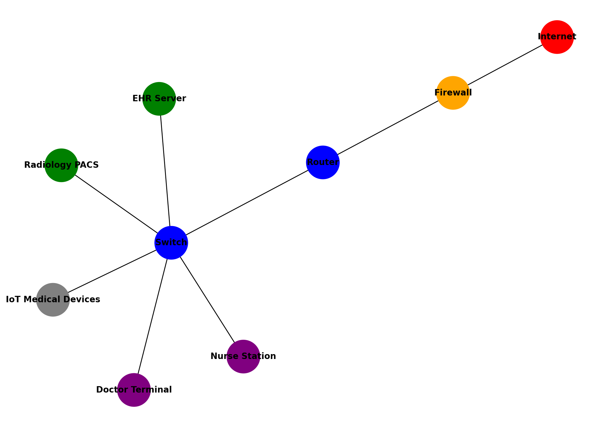
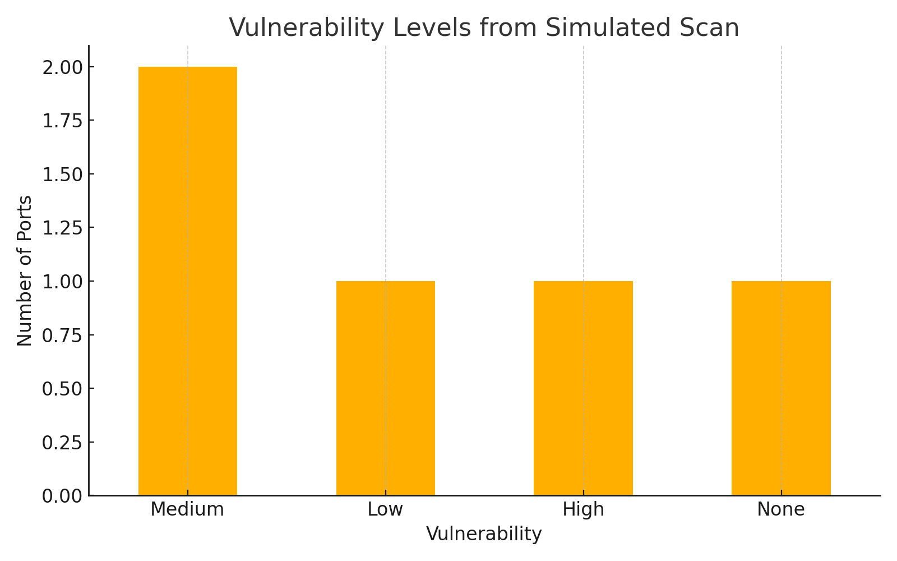
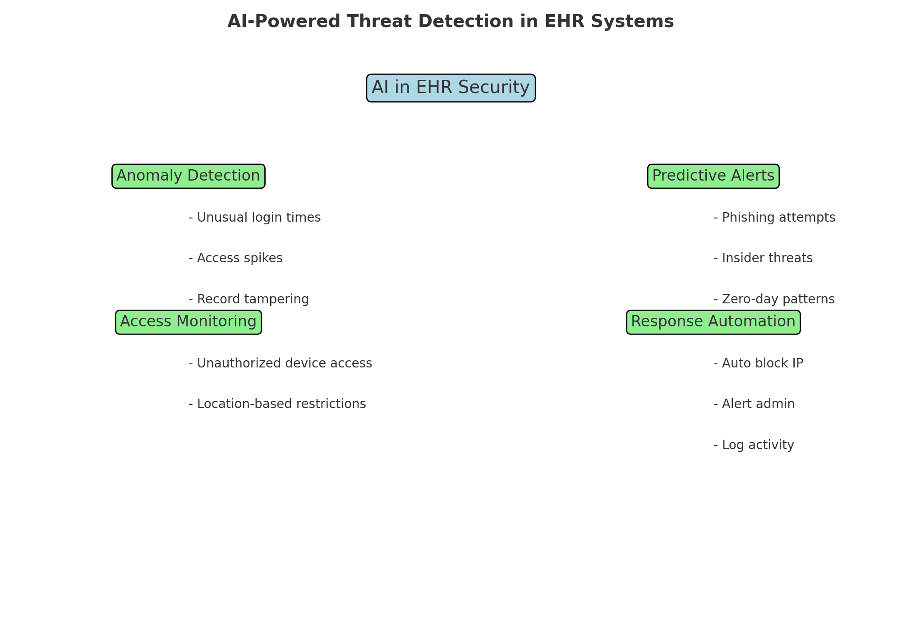

# 🛡️ Healthcare Cybersecurity Visuals & Concepts

Welcome! This repository showcases a set of visuals I created as part of my journey into **Cybersecurity in Healthcare**, powered by **AI**, **network security**, and a lot of curiosity. I'm a recent graduate in **Health Informatics**, and I'm exploring how technology can protect patient data while improving care.

---

## 📊 Visual Portfolio

### 🏥 1. Hospital Network Layout (Simulated)
A mock hospital network setup showing secure connections between internal systems (EHR, PACS, IoT devices) and external internet access via firewalls and routers.

---

### 🔍 2. Vulnerability Scan Summary (Simulated Nmap/Wireshark Output)
Bar chart visualizing vulnerabilities across different network ports, mimicking what a basic scan might reveal in a healthcare environment.

---

### 🤖 3. AI-Powered EHR Threat Detection Mind Map
Mind map showing how AI can detect anomalies, trigger alerts, and automate responses to protect Electronic Health Records from cyber threats.

---

## 👨‍💻 About Me
I’m Nikhil Reddy Chitkula, a recent **Master’s in Health Informatics** graduate passionate about:
- 🔐 Cybersecurity in healthcare
- 🤖 AI for anomaly detection
- 🩺 Securing EHR and patient data
- 📈 Building real-time, visual learning projects

🔗 Let’s connect on [LinkedIn](https://www.linkedin.com/in/nikhil-reddy-chitkula/)

---

## 💬 Why This Repo?
This is a growing portfolio of hands-on visuals, mock assessments, and concepts as I apply for **entry-level roles in cybersecurity and health IT**.

> “To err is human. To patch it—divine.” 😄

---

#HealthInformatics #Cybersecurity #AIinHealthcare #VisualLearning #EHRSecurity #NewToTech
